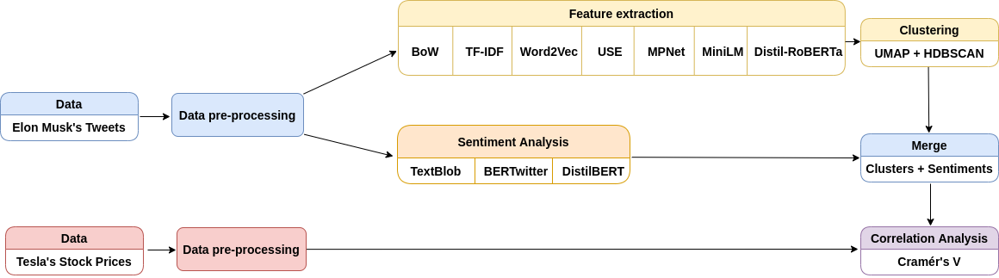

<div align="center">

# Clustering and Sentiment Analysis: How Elon Musk Controls the Tesla Stock Prices Using Twitter
<h3 align="center"> ML701 - Machine Learning </h3>
  
</div>

## Description

<p float="center">
  
   
</p>
“Tesla’s stock price is too high imo” - this tweet was posted on the 1st May of 2020 by Elon Musk. On the same day, Tesla's stock price had a significant drop by ten percent. The link between Twitter and Stocks markets has been explored before. Most of them dealt with the crowd's opinion and tweets were either labeled manually or selected with certain conditions. The problem with such an approach is that it doesn't consider the whole scale of tweets, and possibly overfits in some cases. Meanwhile, our project focuses on the entire history of Elon Musk's Twitter and applies unsupervised techniques for identifying Tesla-related tweets. Our agenda is to cluster the tweets using unsupervised learning methods to find the Tesla-related tweets, then find their sentiments and finally get the correlation with stocks. Ultimately, we want to make a pipeline that can identify the topic of the new tweet, its sentiment and tell if the stock will increase or decrease. We checked the following hypothesis, does the sentiment of Musk's tweets have any correlation with Tesla's stock prices throughout 10 years.  There are specific cases that show the influence of Musk's social media tool on the stocks market, however, the latter depends on so many other factors like news about their competitors, quality of their products, etc. Our project tried to weigh Twitter's influence on Tesla's economy. For that purpose, we calculated the Cramer's V correlation coefficient. While we understand that the tone of the tweet may not correlate with the increase or decrease of the stocks, our hypothesis is based on several previous works that have tested the same exact connection.

## Project pipeline
<p float="center">
  
</p>


## Installation
For this project, you must have the ```cuda-11.2``` support. Run the code below to install the required libraries for this project:

```yaml
# clone project
git clone https://github.com/kmaksatk/Twitter_Stocks_Correlation.git
cd Twitter_Stocks_Correlation

# create conda environment with necessary libraries
conda env create --name your_env_name --file requirements.yml
conda activate your_env_name
```
If you have the required version of ```cuda```, but at startup it says that the version of cuda and libraries do not match, try the following commands:
```yaml
# to watch available versions of cuda
module avail
# select the necessary version of cuda
module load cuda-11.2
# to check the version of cuda
which nvcc
```
## Project Files Description
<p>The repository has two branches: master and topic_modelling <br>
Master: main repository used in the project <br>
Topic_modelling: This is a work in progress, its not mentioned in the paper, but we liked the approach of topic modelling and possibly will implement it in the future for ourselves. </p>
<p>This project includes 3 notebook files, 5 method files as well as 2 directories as follows:</p>
<h4>Notebook Files:</h4>
<ul>
  <li><b>clustering_analysis.ipynb</b> - performs clustering on tweets using different embeddings</li>
  <li><b>sentiment_analysis.ipynb</b> - performs sentiment analysis on the tweet data using different methods</li>
  <li><b>correlation_analysis.ipynb</b> - performs sentiment analysis on the tweet data using different methods</li>
</ul>

<h4>Method Files:</h4>
<ul>
  <li><b>data_preprocessing.py</b> - contains methods for cleaning tweets and stocks</li>
  <li><b>clustering.py</b> - supports the clustering_analysis.ipynb file by providing methods for clustering</li>
  <li><b>sentiment.py</b> - supports the sentiment_analysis.ipynb file by providing methods for sentiment analysis</li>
  <li><b>correlation.py</b> - supports the correlation_analysis.ipynb file by providing methods for correlation calculations</li>
  <li><b>main.py</b> - runs the files to show the project results </li>
</ul>

<h4>Source Directories:</h4>
<ul>
  <li><b>files</b> - contains .сsv files which contain data from Elon Musk's tweets and Tesla's stocks after applying various operations</li>
  <li><b>word clouds</b> - contains wordclouds of clusters from different embedding methods</li>
</ul>

<h4>'files' directory structure:</h4>
<ul>
  <li><b>musk_tweets.csv</b> - raw data of Elon Musk's tweets</li>
  <li><b>tesla_stocks.csv</b> - raw data of Tesla's stocks</li>
  <li><b>clean_stocks.csv</b> - stocks data after preprocessing and adding missing dates using data_preprocessing.py</li>
  <li><b>clean_tweets_with_stopwords.csv</b> - preprocessed tweets with stopwords from data_preprocessing.py for transformer based embeddings</li>
  <li><b>clean_tweets_without_stopwords.csv</b> - preprocessed tweets without stopwords from data_preprocessing.py for Bag-of-Words, TF-IDF, and Word2Vec embeddings</li>
  <li><b>clusterized_tweets_with_stopwords.csv</b> - clusterized tweets with transformer based embeddings from clustering_analysis.ipynb</li>
  <li><b>clusterized_tweets_without_stopwords.csv</b> - clusterized tweets with Bag-of-Words, TF-IDF, and Word2Vec embeddings from clustering_analysis.ipynb</li>
  <li><b>sentimented_tweets_with_stopwords.csv</b> - tweets with stopwords run through sentiment analysis from sentiment_analysis.ipynb</li>
  <li><b>sentimented_tweets_without_stopwords.csv</b> - tweets without stopwords run through sentiment analysis from sentiment_analysis.ipynb</li>
  <li><b>cramer_results.csv</b> - contains final Cramer's V coefficients for all the method combinations, created from correlation_analysis.ipynb</li>
  <li><b>pipeline.png</b> - contains the architecture pipeline of our project
</ul>


<h4>Modifed methods from the existing code-bases:</h4>
clustering.py:
<ul>
  <li><b>generate_clusters.py</b> - was modified for GPU support</li>
  <li><b>objective.py</b> - the objective function was modified to the DBCV metric</li>
  <li><b>generate_clusters.py</b> - was modified for GPU support</li>
  <li><b>plot_clusters.py</b> - was modified for GPU support and show the results in different scale</li>
</ul>
  


## Demo 
Since we have a NLP-specific tasks our inputs and outputs are just tables. As inputs we take the datasets extracted from files musk_tweets.csv and tesla_stocks.csv. The final result with Cramer's V coefficient results can be seen in cramer_results.csv. For your ease, we created a script that describes the files and shows the first five rows. Just run the code below and follow the instructions inside. 

```yaml
python3 main.py
```

To see the detailed results of the clustering, sentiment analysis and the correlation estimation see the corresponding .ipynb notebooks. They have detailed descriptions of the process and results.
#### WARNING: DO NOT RUN THE NOTEBOOKS BY YOURSELF, THE FINAL RESULT MAY DIFFER FROM THE ONES IN THE PAPER IF YOU RUN THEM.

## Datasets

The datasets are both available at kaggle.com
1. [Elon Musk Tweets (2010 - 2021)](https://www.kaggle.com/ayhmrba/elon-musk-tweets-2010-2021?select=2021.csv)
2. [TESLA Stock Data](https://www.kaggle.com/varpit94/tesla-stock-data-updated-till-28jun2021?select=TSLA.csv)

## Authors

Adilbek Karmanov (@kdiAAA) 

[](https://github.com/kdiAAA)
[](https://www.linkedin.com/in/adilbek-karmanov/)

Maksat Kengeskanov (@kmaksatk)

[](https://github.com/kmaksatk)
[](https://www.linkedin.com/in/maksat-kengeskanov/)
